# Lossless JPEG Project
Jack Burdick


## Project Information
We'll explore a, basic, handcrafted JPEG lossless encoder; We'll convert an image into a binary string that can then be recreated into the original image without loosing an details -- hence the lossless bit.

##### NOTE:
_This project uses an image of size 16x16 pixels.  These values are hardcoded into the project.  If you want to use an image of another size you can change the values.  Please also note that the image dimensions are not saved in the encoded string, meaning you'll have to ensure you take this into consideration when decoding._

## Overview

From the above steps;
1. We'll start with an matrix of integers, which we'll import as an image, 
2. Encode the image from an array of ints to a string of binary numbers
    * Predict new value from the image (using a given predictor equation)
    * Encode the difference
3. Reverse these steps to recreate the image
4. Evaluate the performance of the 7 difference predictors

### What does the image look like?


## Predictor Equations
### What is it?
The predictor function creates a new value from the current JPEG image
### Why do we need a new value?
The original image has integer pixel values that range from [0-255]. This means that each pixel value requires at 8-bits -- 255 in binary is 8 bits (2^8 = 256).  The basic idea is that rather than encode these (potentially) large values that require 8 bits, we'll only encode a smaller value.  Enter the predictor equation.
###  How does it work?
Below (predictor functions) shows the 7 different cases we'll be using, but this block diagram shows the overview.  The idea is to take our matrix of pixel values, look at the values around a specific pixel value, then, depending on the predictor function, create a new value that is relative to these surrounding values.


### What do these predictor functions you speak of look like?
These are the 7 predictor equations we'll be using - each labeled as case 0 through case 7


### I'll take, 'can you give me an example, Jack' for 200


##### But.. uhhh... so what about the values in the first row -- they don't have a `B` value.. AND! what about the values in the first column! -- they don't have a `A` value.. are you trying to pull a fast one on us?

### Right, so the first column and first row all require special attention


### Why does this matter?
In the final section we'll look at some performance metrics -- spoiler alert: the storage size of the image becomes smaller without sacrificing any image information

### Tools
We'll use python for this assignment and since there's a fair amount of code to explain, we'll create and talk through the script step by step.  The Results will then be displayed in-line after all calculations are made 
#### Imports
We'll need:
1. numpy
    * matrix manipulations
2. skimage
    * view the image
3. matplotlib
    * creating figures
4. math
    * calculating square root


```python
import numpy as np
from skimage import io
from matplotlib import pyplot as plt
import math

# jupyter notebook config: display the created plots
%matplotlib inline
```


```python
# path to our selected 'array' of ints
input_image_asTXT_path = './image_input.txt'
```

### Read in original image from txt file (received format) and convert image to numpy array


```python
def create_image_matrix(input_image_asTXT_path, img_height, img_width):
    # create a matrix of the proper size
    original_image = np.zeros((img_width, img_height))
    # fill empty matrix with specified values
    with open(input_image_asTXT_path) as inVals:
        img_row = []
        row_num = 0
        for line in inVals:
            line = line.strip("\n")
            line_list = line.split(" ")
            line_l_clean = [int(val.strip(" ")) for val in line_list if val != ""]
            # print(line_l_clean)
            original_image[row_num] = line_l_clean
            row_num += 1
    return original_image
```


```python
original_image = create_image_matrix(input_image_asTXT_path, 16, 16)
```

#### `original_image` holds our image.. Let's inspect to ensure we've captured it correctly


```python
# print raw matrix values
print("Original Image:\n", original_image)
# print shape
print("Image dimensions:", original_image.shape)
```

    Original Image:
     [[  88.   88.   88.   89.   90.   91.   92.   93.   94.   95.   93.   95.
        96.   98.   97.   94.]
     [  93.   91.   91.   90.   92.   93.   94.   94.   95.   95.   92.   93.
        95.   95.   95.   96.]
     [  95.   95.   95.   95.   96.   97.   94.   96.   97.   96.   98.   97.
        98.   99.   95.   97.]
     [  97.   96.   98.   97.   98.   94.   95.   97.   99.  100.   99.  101.
       100.  100.   98.   98.]
     [  99.  100.   97.   99.  100.  100.   98.   98.  100.  101.  100.   99.
       101.  102.   99.  100.]
     [ 100.  101.  100.   99.  101.  102.   99.  100.  103.  102.  103.  101.
       101.  100.  102.  101.]
     [ 100.  102.  103.  101.  101.  100.  102.  103.  103.  105.  104.  104.
       103.  104.  104.  103.]
     [ 103.  105.  103.  105.  105.  104.  104.  104.  102.  101.  100.  100.
       100.  101.  102.  103.]
     [ 104.  104.  105.  105.  105.  104.  104.  106.  102.  103.  101.  101.
       102.  101.  102.  102.]
     [ 102.  105.  105.  105.  106.  104.  106.  104.  103.  101.  100.  100.
       101.  102.  102.  103.]
     [ 102.  105.  105.  105.  106.  104.  106.  104.  103.  101.  100.  100.
       101.  102.  102.  103.]
     [ 102.  105.  105.  105.  106.  104.  105.  104.  103.  101.  102.  100.
       102.  102.  102.  103.]
     [ 104.  105.  106.  105.  106.  104.  106.  103.  103.  102.  100.  100.
       101.  102.  102.  103.]
     [ 103.  105.  107.  107.  106.  104.  106.  104.  103.  101.  100.  100.
       101.  102.  102.  103.]
     [ 103.  105.  106.  108.  106.  104.  106.  105.  103.  101.  101.  100.
       101.  103.  102.  105.]
     [ 102.  105.  105.  105.  106.  104.  106.  107.  104.  103.  102.  100.
       101.  104.  102.  104.]]
    Image dimensions: (16, 16)


Everything looks good here; it matches the expected values from the input txt file.

#### Inspect grayscale image to satisfy curiosity


```python
plt.imshow(original_image, cmap='gray')
```


    <matplotlib.image.AxesImage at 0x112fd1438>


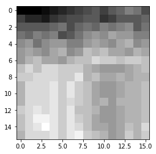


A little less excting than I was hoping for.. but let's move on

## Predictor Calculations
### Given: 7 predictor equations
### Plan
* Input
    * Image matrix of raw values
        * `original_image`
        * `CASE`
* Implementation
    * Create a function (`prediction_generator()`) that generates the predicted value, given A,B,C, the current value, and the specified case
    * Given the above function, create a function (`create_differences_matrix_with_case()`) that, using a parameter flag, uses the specified predictor and outputs the predicted value
* Output
    * A Matrix of the difference values


```python
def prediction_generator(cur_val, case, values):
    A = values[0]
    B = values[1]
    C = values[2]

    # this flag will go high when there is potential for a float value difference to be generated
    float_flag = False

    if(case == 0):
        val_not = A
    elif(case == 1):
        val_not = B
    elif(case == 2):
        val_not = C
    elif(case == 3):
        val_not = A + B - C
    elif(case == 4):
        val_not = A + ((B - C)/2)
        float_flag = True
    elif(case == 5):
        val_not = B + ((A - C)/2)
        float_flag = True
    elif(case == 6):
        val_not = (A + B)/2
        float_flag = True
    else:
        print("we didn't plan for this....")

    diff = cur_val - val_not

    # to account for the float, we will multiply all values
    # for the specific case by 2 to ensure we return an integer
    # this will be important when encoding/decoding
    if float_flag:
        # pass
        diff_double = diff * 2
        diff = diff_double
    return diff
```

### Special considerations
The first column and first row of the images require 'special treatment'.
* The first row doesn't have a value above it (B)
* The first column doesn't have a value to the left of it (A)
* Neither the first column, nor the first row, have a value to the upper left of them (C)

This will be taken into account (as shown in the above function) by implementing independent functions for the first row and first column


```python
# handle the first row of the image values
def get_pred_row_1(row, cur_col):
    # pred = current - (A)left
    A_val = row[cur_col - 1]
    x_val = row[cur_col]
    pred = x_val - A_val
    # DEBUGGING: print statement showing pred calc
    # print("A(", A_val, ")", "-", "cur(", x_val, ")", " = ", pred)
    return pred
```


```python
# handle the first column of the image values
def get_pred_col_1(cur_row, cur_col, original_image):
    # pred = current - (B)above
    B_val = original_image[cur_row-1][cur_col]
    x_val = original_image[cur_row][cur_col]
    pred = x_val - B_val
    # DEBUGGING: print statement showing pred calc
    # print("cur(", x_val, ")", "-", "B(", B_val, ")", " = ", pred)
    return pred
```


```python
# create prediction matrix
# this uses the prediction_generator to get each value
def create_differences_matrix_with_case(original_image, case):

    # create difference matrix
    img_width, img_height = original_image.shape 
    diff_matrix = np.zeros((img_width, img_height))
    
    # index values
    cur_row = 0
    cur_col = 0

    # copy first value
    diff_matrix[cur_row][cur_col] = original_image[cur_row][cur_col]
    # loop rows in the image
    for row in original_image:
        # first row is a special case
        if cur_row == 0:
            cur_col = 0
            for col_val in row:
                # the first value is already copied
                if cur_col != 0:
                    value = get_pred_row_1(row, cur_col)
                    diff_matrix[cur_row][cur_col] = value
                cur_col += 1
        else:
            cur_col = 0
            for col_val in row:
                if cur_col == 0:
                    diff_value = get_pred_col_1(cur_row,
                                                cur_col,
                                                original_image)
                    diff_matrix[cur_row][cur_col] = diff_value
                else:
                    # Main implementation (first row/col have been calculated)
                    # get prediction according to case
                    current_val = original_image[cur_row][cur_col]
                    A = original_image[cur_row][cur_col-1]
                    B = original_image[cur_row-1][cur_col]
                    C = original_image[cur_row-1][cur_col-1]
                    values = [A, B, C]
                    diff_value = prediction_generator(current_val,
                                                      case,
                                                      values)
                    diff_matrix[cur_row][cur_col] = diff_value
                cur_col += 1
        cur_row += 1
    return diff_matrix
```

### Test that our difference matrix is being generated


```python
diff_matrix = create_differences_matrix_with_case(original_image, 0)
print(diff_matrix)
```

    [[ 88.   0.   0.   1.   1.   1.   1.   1.   1.   1.  -2.   2.   1.   2.
       -1.  -3.]
     [  5.  -2.   0.  -1.   2.   1.   1.   0.   1.   0.  -3.   1.   2.   0.
        0.   1.]
     [  2.   0.   0.   0.   1.   1.  -3.   2.   1.  -1.   2.  -1.   1.   1.
       -4.   2.]
     [  2.  -1.   2.  -1.   1.  -4.   1.   2.   2.   1.  -1.   2.  -1.   0.
       -2.   0.]
     [  2.   1.  -3.   2.   1.   0.  -2.   0.   2.   1.  -1.  -1.   2.   1.
       -3.   1.]
     [  1.   1.  -1.  -1.   2.   1.  -3.   1.   3.  -1.   1.  -2.   0.  -1.
        2.  -1.]
     [  0.   2.   1.  -2.   0.  -1.   2.   1.   0.   2.  -1.   0.  -1.   1.
        0.  -1.]
     [  3.   2.  -2.   2.   0.  -1.   0.   0.  -2.  -1.  -1.   0.   0.   1.
        1.   1.]
     [  1.   0.   1.   0.   0.  -1.   0.   2.  -4.   1.  -2.   0.   1.  -1.
        1.   0.]
     [ -2.   3.   0.   0.   1.  -2.   2.  -2.  -1.  -2.  -1.   0.   1.   1.
        0.   1.]
     [  0.   3.   0.   0.   1.  -2.   2.  -2.  -1.  -2.  -1.   0.   1.   1.
        0.   1.]
     [  0.   3.   0.   0.   1.  -2.   1.  -1.  -1.  -2.   1.  -2.   2.   0.
        0.   1.]
     [  2.   1.   1.  -1.   1.  -2.   2.  -3.   0.  -1.  -2.   0.   1.   1.
        0.   1.]
     [ -1.   2.   2.   0.  -1.  -2.   2.  -2.  -1.  -2.  -1.   0.   1.   1.
        0.   1.]
     [  0.   2.   1.   2.  -2.  -2.   2.  -1.  -2.  -2.   0.  -1.   1.   2.
       -1.   3.]
     [ -1.   3.   0.   0.   1.  -2.   2.   1.  -3.  -1.  -1.  -2.   1.   3.
       -2.   2.]]


This looks good. How about for the cases when a float value could be created?


```python
diff_matrix = create_differences_matrix_with_case(original_image, 5)
print(diff_matrix)
```

    [[ 88.   0.   0.   1.   1.   1.   1.   1.   1.   1.  -2.   2.   1.   2.
       -1.  -3.]
     [  5.   1.   3.  -1.   3.   2.   2.   0.   1.  -1.  -2.  -3.   0.  -5.
       -1.   6.]
     [  2.   6.   4.   6.   3.   4.  -4.   4.   2.   0.  11.   2.   2.   5.
       -4.   2.]
     [  2.   0.   5.   1.   2.  -8.   5.   1.   3.   6.  -2.   7.   0.   0.
        5.  -1.]
     [  2.   6.  -6.   5.   2.  10.   0.  -1.   1.   1.   1.  -5.   4.   3.
        0.   3.]
     [  1.   1.   5.  -3.   2.   3.   0.   3.   4.  -1.   5.   1.  -2.  -4.
        8.  -1.]
     [  0.   2.   5.   1.  -2.  -4.   8.   3.  -3.   6.  -1.   5.   1.   6.
        0.   2.]
     [  3.   3.  -3.   8.   4.   4.   0.   0.  -3.  -7.  -4.  -4.  -2.  -3.
       -1.   2.]
     [  1.  -3.   5.  -2.   0.   0.   0.   4.  -2.   4.   0.   1.   3.  -2.
        0.  -2.]
     [ -2.   4.  -1.   0.   2.  -1.   4.  -6.   4.  -5.   0.  -1.  -1.   3.
       -1.   2.]
     [  0.   0.   0.   0.   0.   0.   0.   0.   0.   0.   0.   0.   0.   0.
        0.   0.]
     [  0.   0.   0.   0.   0.   0.  -2.   1.   0.   0.   4.  -2.   2.  -1.
        0.   0.]
     [  2.  -2.   2.  -1.   0.   0.   2.  -3.   1.   2.  -5.   2.  -2.   1.
        0.   0.]
     [ -1.   1.   2.   3.  -2.   0.   0.   2.  -1.  -2.   1.   0.   0.   0.
        0.   0.]
     [  0.   0.  -2.   3.  -1.   0.   0.   2.  -1.   0.   2.  -1.   0.   2.
       -1.   4.]
     [ -1.   1.  -2.  -5.   3.   0.   0.   4.   0.   3.   0.  -1.   0.   2.
       -1.  -2.]]


It's working as intended.. note that the values go much higher here.. in one case the value is 11!

#### Overview to expand on the encoding/decoding scheme
1. View the current encoding/decoding scheme
2. Ensure reproducible pattern exists (it should, it's huffman encoding)
3. Create a custom function to expand on this
4. Test function


```python
# step 1
huffan_lookup_txt_path = './huffman_tb_dx_input.txt'
test_huffman_dict = {}
with open(huffan_lookup_txt_path) as lookupVals:
    for line in lookupVals:
        line = line.strip("\n")
        cur_pair = line.split(",")
        cur_key = int(cur_pair[0])
        cur_val = cur_pair[1]
        test_huffman_dict[cur_key] = cur_val

# step 2
print(test_huffman_dict)
```

    {0: '1', 1: '00', 2: '0100', 3: '010100', 4: '01010100', 5: '0101010100', 6: '010101010100', -2: '01011', -6: '0101010101011', -5: '01010101011', -4: '010101011', -3: '0101011', -1: '011'}


```python
# step 3
def create_bin_dict(MAX_LEN):
    created_dict = {}
    created_dict['0'] = '1'
    max_len = MAX_LEN
    # add positives
    pos_end_string = '00'
    val = 0
    while val <= max_len:
        cur_string = ''
        i = 0
        while i < val:
            cur_string += '01'
            i += 1
        val += 1
        cur_string += pos_end_string
        created_dict[str(val)] = cur_string
        # print("val: ", val, "string: \t", cur_string)

    # add negatives
    neg_end_string = '1'
    val = -0
    while val >= -max_len:
        cur_string = ''
        i = 0
        while i >= val:
            cur_string += '01'
            i -= 1
        val -= 1
        cur_string += neg_end_string
        created_dict[str(val)] = cur_string
        # print("-val: ", val, "string: \t", cur_string)
    return created_dict

# step 4
# we'll be using 11 as the max length because I know this will handle all cases for the given image
huffman_dict = create_bin_dict(11)
print(huffman_dict)
```

    {'-6': '0101010101011', '10': '01010101010101010100', '9': '010101010101010100', '-4': '010101011', '-1': '011', '0': '1', '5': '0101010100', '-7': '010101010101011', '-2': '01011', '4': '01010100', '-10': '010101010101010101011', '11': '0101010101010101010100', '-11': '01010101010101010101011', '12': '010101010101010101010100', '2': '0100', '1': '00', '3': '010100', '6': '010101010100', '7': '01010101010100', '8': '0101010101010100', '-3': '0101011', '-9': '0101010101010101011', '-5': '01010101011', '-8': '01010101010101011', '-12': '0101010101010101010101011'}


## Taking a step back
### What's all this huffman coding business?
The basic assumption during this project, is that the predictor values will be small -- meaning the adjacent pixels will be ~similar (this is investigated in the discussion).  But, for a moment, let's assume that the image is _roughly_ smooth -- the adjacent pixels ARE similar.  What does this mean?

This means we could assume, most of the time, we'll create this `diff_matrix` with values that are mostly |0|, then |1|, then |2|, and so on...

SO, if we assume all this, then we'd want to encode 0 to the smallest unique binary sequence and 1 to the next smallest unique binary sequence.  This is because then (more likely than not) the final binary sequence would be as small as possible.

NOTE: Rather than create a new dictionary for each value, based on the max absolute difference value; in this project, we will create a single globally scoped `huffman_dict` that we can access. This would not scale well, but creating a the dictionary for each image based on the max value isn't important to this report

### Problem:
Though the dictionary works well for converting an int to binary string, We also need to be able to convert the first value in the matrix to a binary string.  This first value is always 8 bits.  Rather than hard code this we'll use a python conversion


```python
# test binary converstion
test_bin_int = 67
test_bin_string = '{0:08b}'.format(test_bin_int)
print(test_bin_string)
```

    01000011


Nice, that' works; `67` in binary is `01000011`
We'll need this for our next function

# Overview: where are we so far
Right now we have:
* Image Matrix
    * `original_image`
* Predicted values -> Difference Matrix
    * `diff_matrix`
* An encoding scheme
    * `huffman_dict`

# What's next
1. Encode to binary string
    * The 'heavy lifting' is already done here
2. Decode back to original image
    * Essentially reverse what we've already done
3. Test all cases and make sure all image values are stored
    * Since we're passing everything as flags/values, we should be able to easily test all cases
4. Compare/contrast methods
    * Better get some popcorn, this is bound to be a thriller


```python
# given the diff_matrix and encoding scheme, we can quickly create the binary string
def encode_diffMatrix(diff_matrix, huffman_dict):
    # loop through image
    row_ind = 0
    # col_index = 0
    encoded_string = ""
    for row in diff_matrix:
        col_index = 0
        for col_val in row:
            if row_ind == 0 and col_index == 0:
                # this is where the above conversion comes in handy
                val_int = int(diff_matrix[row_ind][col_index])
                encoded_value = '{0:08b}'.format(val_int)
            else:
                cur_val = diff_matrix[row_ind][col_index]
                encoded_value = huffman_dict[str(int(cur_val))]
            encoded_string += encoded_value
            col_index += 1
        row_ind += 1
    return encoded_string
```


```python
# test to ensure we're creating a string
encoded_string = encode_diffMatrix(diff_matrix, huffman_dict)
print(encoded_string)
```

    0101100011000000000000000101101000001000110101011010101010000010100011010100010001001000110101101010111010101010110110101010101000100010101010100010101000101010101000101000101010001010101101010100010010101010101010101010100010001000101010100010101011010001001010101010000010001010101010101011010101010000010100010101010100010110101010101010011010101010001101000101010101000101010101011010101010001000101010101010101010010110000000101010101101010100010100101010000000101010100010101101000101001010100010101000110101010100000101101010101101010101010101000111010001010101000001011010101011010101010101010001010001010110101010101000110101010100000101010101001010001010001010001010110101010101010100010101000101010011010101101010101010101101010101101010101101011010101101101000001010110101010100010111110101010001011010101001000101000101110101101011010101000111010001101010100010101010101101010100010101010111011011010100011010011111111111111111111110101100110101010001011010001111010001011010001111010001010110001000101010101101000101100110110001000101000101111010001101011001111111010110101000111101000111010001110100011010101000110001011010101010110101001101010100101010010111010001101011


## From binary string to JPEG
Now that we've converted to a binary string we have to start the process of decoding a binary string to a JPEG image.

### Plan:
1. Write a single function that
    * takes inputs:
        * binary encoded string
        * target image width and height
        * a decoding dictionary scheme
        * the case (reverse predictor to use)
    * Returns:
        * image matrix
        
Note, we want to ensure we don't pass the original image (we are 'recreating' it from the binary string).

### Note:
Since this decoding is identical to encoding (only in reverse) I will not be explaining every step in detail.  If you have questions about this, please feel free to email me

#### First
1. We have to create a reverse dictionary that is the same as the current dictionary.
    * Reverse since we now want to go from binary to int
2. We'll need special functions to handle the first column and first rows again

#### Reverse huffman dict


```python
huffman_dict_rev = {val: key for key, val in huffman_dict.items()}
```

#### Get image height and width from the original image (ideally this would be encoded in the string)


```python
img_width, img_height = original_image.shape
print(img_width, img_height)
```

    16 16


```python
# Calculated decoded value according to our 7 cases
def decode_val_from_case(case, row_index, col_index, created_dif_matrix, img_frm_decoded):
    
    cur_diff = created_dif_matrix[row_index][col_index]

    A = img_frm_decoded[row_index][col_index-1]
    B = img_frm_decoded[row_index-1][col_index]
    C = img_frm_decoded[row_index-1][col_index-1]

    float_flag = False
    if(case == 0):
        cmp_val = A
    elif(case == 1):
        cmp_val = B
    elif(case == 2):
        cmp_val = C
    elif(case == 3):
        cmp_val = A + B - C
    elif(case == 4):
        cmp_val = A + ((B - C)/2)
        float_flag = True
    elif(case == 5):
        cmp_val = B + ((A - C)/2)
        float_flag = True
    elif(case == 6):
        cmp_val = (A + B)/2
        float_flag = True
    else:
        print("we didn't plan for this....")

    if float_flag:
        cur_diff /= 2

    new_val = cmp_val + cur_diff
    # print(new_val)
    return new_val
```


```python
def decode_first_row_val(cur_index, created_dif_matrix, img_frm_decoded):
    # new_val = left(A) + diff
    cur_diff = created_dif_matrix[0][cur_index]
    A_val = img_frm_decoded[0][cur_index - 1]
    img_val = A_val + cur_diff
    return img_val
```


```python
def decode_first_col_val(cur_row_index, cur_col_index,
                         created_dif_matrix, img_frm_decoded):
    # new_val = above(B) + diff
    cur_diff = created_dif_matrix[cur_row_index][cur_col_index]
    B_val = img_frm_decoded[cur_row_index - 1][cur_col_index]
    img_val = B_val + cur_diff
    return img_val
```


```python
def decode_binaryString_to_diff_matrix(encoded_string,
                                       img_width,
                                       img_height,
                                       huffman_dict_rev,
                                       case):
    created_dif_matrix = np.zeros((img_width, img_height))
    i = 0
    cur_seq = ""
    first_num = encoded_string[:8]
    # convert to int
    first_img_val = int(first_num, 2)
    val_list = []
    val_list.append(first_img_val)
    img_values = encoded_string[8:]
    for bin_seq in img_values:
        cur_seq += bin_seq
        if cur_seq in huffman_dict_rev:
            val_int = huffman_dict_rev[cur_seq]
            # DEBUGGING: print statement to ensure conversion
            # print("#", i, ": ", cur_seq, " = ", val_int)
            val_list.append(int(val_int))
            cur_seq = ""
            i += 1

    cur_col_index = 0

    # recreate diff matrix
    img_row_index = 0
    img_col_index = 0
    for val in val_list:
        if img_col_index == img_width:
            img_row_index += 1
            img_col_index = 0
        created_dif_matrix[img_row_index][img_col_index % img_width] = val
        img_col_index += 1

    # Show that we've recreated the difference matrix
    # print("CREATED DIF MATRIX")
    # print(created_dif_matrix)

    # create first row in recreated img
    img_frm_decoded = np.zeros((img_width, img_height))
    img_frm_decoded[0][0] = created_dif_matrix[0][0]

    # loop through each row
    row_index = 0
    for diff_row in created_dif_matrix:
        col_index = 0
        # handle special case for first row
        if row_index == 0:
            # start at 1 since the first value is already handled
            col_index += 1
            while col_index < img_width:
                val = decode_first_row_val(col_index,
                                           created_dif_matrix,
                                           img_frm_decoded)
                img_frm_decoded[row_index][col_index] = val
                col_index += 1
        else:
            while col_index < img_width:
                if col_index == 0:
                    # handle special case first column value
                    val = decode_first_col_val(row_index, col_index,
                                               created_dif_matrix,
                                               img_frm_decoded)
                    img_frm_decoded[row_index][col_index] = val
                    col_index += 1
                else:
                    # Main implementation
                    val = decode_val_from_case(case,
                                               row_index, col_index,
                                               created_dif_matrix,
                                               img_frm_decoded)
                    img_frm_decoded[row_index][col_index] = val
                    col_index += 1
        row_index += 1

    return img_frm_decoded
```


```python
# test case
case = 5
test_re_created_img = decode_binaryString_to_diff_matrix(encoded_string,
                                       img_width,
                                       img_height,
                                       huffman_dict_rev,
                                       case)

# this should be a matrix that matches our original matrix
print(test_re_created_img)
```

    [[  88.   88.   88.   89.   90.   91.   92.   93.   94.   95.   93.   95.
        96.   98.   97.   94.]
     [  93.   91.   91.   90.   92.   93.   94.   94.   95.   95.   92.   93.
        95.   95.   95.   96.]
     [  95.   95.   95.   95.   96.   97.   94.   96.   97.   96.   98.   97.
        98.   99.   95.   97.]
     [  97.   96.   98.   97.   98.   94.   95.   97.   99.  100.   99.  101.
       100.  100.   98.   98.]
     [  99.  100.   97.   99.  100.  100.   98.   98.  100.  101.  100.   99.
       101.  102.   99.  100.]
     [ 100.  101.  100.   99.  101.  102.   99.  100.  103.  102.  103.  101.
       101.  100.  102.  101.]
     [ 100.  102.  103.  101.  101.  100.  102.  103.  103.  105.  104.  104.
       103.  104.  104.  103.]
     [ 103.  105.  103.  105.  105.  104.  104.  104.  102.  101.  100.  100.
       100.  101.  102.  103.]
     [ 104.  104.  105.  105.  105.  104.  104.  106.  102.  103.  101.  101.
       102.  101.  102.  102.]
     [ 102.  105.  105.  105.  106.  104.  106.  104.  103.  101.  100.  100.
       101.  102.  102.  103.]
     [ 102.  105.  105.  105.  106.  104.  106.  104.  103.  101.  100.  100.
       101.  102.  102.  103.]
     [ 102.  105.  105.  105.  106.  104.  105.  104.  103.  101.  102.  100.
       102.  102.  102.  103.]
     [ 104.  105.  106.  105.  106.  104.  106.  103.  103.  102.  100.  100.
       101.  102.  102.  103.]
     [ 103.  105.  107.  107.  106.  104.  106.  104.  103.  101.  100.  100.
       101.  102.  102.  103.]
     [ 103.  105.  106.  108.  106.  104.  106.  105.  103.  101.  101.  100.
       101.  103.  102.  105.]
     [ 102.  105.  105.  105.  106.  104.  106.  107.  104.  103.  102.  100.
       101.  104.  102.  104.]]


This looks similar, let's test it by comparing the two matrixes (original and recreated) in image representation


```python
def create_side_by_side_figure(original_image, recreated_img, CURCASE):
    # plt.figure(figsize=(6, 3))
    fig, axes = plt.subplots(1, 2, figsize=(6, 3))
    axes[0].imshow(original_image, cmap='gray')
    axes[0].set_title("Original")
    # plt.subplot(1, 2, 2)
    axes[1].imshow(recreated_img, cmap='gray')
    title = "Case: " + str(CURCASE)
    axes[1].set_title(title)
    plt.show()
```


```python
create_side_by_side_figure(original_image, test_re_created_img, case)
```


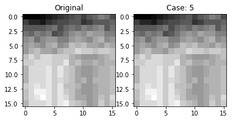


## They look the same!
This is good news, it means that for the given predictor method, we have succuessfully encoded and decoded the image

# We now need to wrap all of this into one function so we can show each step for each method


```python
# original image
original_image = create_image_matrix(input_image_asTXT_path, 16, 16)
img_width, img_height = original_image.shape

# encoding/decoding table
huffman_dict = create_bin_dict(22)
huffman_dict_rev = {val: key for key, val in huffman_dict.items()}

# cases are mapped to int values
cases = [0, 1, 2, 3, 4, 5, 6]

# hold all diff matrix for proof it worked
diff_matrix_list = []

# hold all binary encoded strings for proof/comparison
bin_string_list = []

# hold all the images to display later
reImg_list = []

# encode, then decode, each image, add img to `reImg_list`
for cur_case in cases:
    diff_matrix_cur = create_differences_matrix_with_case(original_image, cur_case)
    diff_matrix_list.append(diff_matrix_cur)
    
    encoded_string_cur = encode_diffMatrix(diff_matrix_cur, huffman_dict)
    bin_string_list.append(encoded_string_cur)
    
    re_img_cur = decode_binaryString_to_diff_matrix(encoded_string_cur, img_width, img_height, huffman_dict_rev, cur_case)
    reImg_list.append(re_img_cur)
```

## Difference Matrix: 
I'll print the second row of each diff matrix (saves on space but still shows it's been calculated).

##### Note: the second row is selected since the first row is identical in every case
If this works, all the matrixes should be ~different and the first value should be the same


```python
i = 0
for i_DM in diff_matrix_list:
    print("CASE: ", cases[i])
    print(i_DM[1])
    i += 1
```

    CASE:  0
    [ 5. -2.  0. -1.  2.  1.  1.  0.  1.  0. -3.  1.  2.  0.  0.  1.]
    CASE:  1
    [ 5.  3.  3.  1.  2.  2.  2.  1.  1.  0. -1. -2. -1. -3. -2.  2.]
    CASE:  2
    [ 5.  3.  3.  2.  3.  3.  3.  2.  2.  1. -3.  0.  0. -1. -3. -1.]
    CASE:  3
    [ 5. -2.  0. -2.  1.  0.  0. -1.  0. -1. -1. -1.  1. -2.  1.  4.]
    CASE:  4
    [ 5. -4.  0. -3.  3.  1.  1. -1.  1. -1. -4.  0.  3. -2.  1.  5.]
    CASE:  5
    [ 5.  1.  3. -1.  3.  2.  2.  0.  1. -1. -2. -3.  0. -5. -1.  6.]
    CASE:  6
    [ 5.  1.  3.  0.  4.  3.  3.  1.  2.  0. -4. -1.  1. -3. -2.  3.]


Everything looks like it should here

# Binary String:
I'll print each binary string (I'll compare them later)


```python
i = 0
for i_BS in bin_string_list:
    print("CASE: ", cases[i])
    print(i_BS)
    i += 1
```

    CASE:  0
    010110001100000000000000010110100000100011010101101010101000101110110100000010010101011000100110001001110000010101101000001101000110000010101011010001000110100011000101010110001000100000110100011101011101000001010110100001010111010000011011010000010101100000001101101000001010110001010001100010111011010001110100000101110110100001010001110110010110101000100010110100101111010110110111100000000100110111010001010101100010111000110010101101010011000101101000101101101011011100001001010100110001011010001011011010110111000010010101001100010110001101101011000101101001100010000000110001011010001010111011010111000010001101000100101101011010001011011010110111000010010100000100010110101101000110101101011101100010001101010001101010011000101101000001010110110110101100010100010110100
    CASE:  1
    0101100011000000000000000101101000001000110101011010101010001010001010000010001000100000010110101101101010110101101000100010101000101010001010101000101010001010100101000100000101010101000101010001010001010100100010000010100010001000101011000001000101010000010101000100000101000001000101010001101000100010101010100010100000000000101100010000010000000101001000100000100010100000101000100101011010100001000101000100101011010100010100101010000010100010001010100010001000101000101001010101000101010001010100010000011010101011010101011010101011010101101010110101110001101001111010010100000001001101101011001100101000101100010110110110110010011111111111111111111110111110100100111010010011100011100010111011111011100010011100101111111111011001110011001100101000111011010101111101000001000011001011
    CASE:  2
    0101100011000000000000000101101000001000110101011010101010001010001010001000101000101000101000100010000010101111011010101101101000100010101000101010001010101010001010101000001000101000001010001010101000101010100010101001010001000001010001000101000101101011010100010100010100010100010100010100010001101010001000101000000010100010001010100010100010100010011101000110100000100101000100010001101000101010100010001000001000111010010100010000010001110101010001010001000100000100010100010101000001010001010101000001000101010001010001010100010001101011010101010110101010110101010110101101011011000010100101110100010110010001000000101011000010001101001010101101101010110111100001010100110001011010001011011010110111000010010101001100010110001011011010110010100001000100010100001000101101000101101101101101011001100011000100000001011010001011101011010111000010010100000001101011010001101101011110001001010100011010010110101101011010000011100011000101000110100
    CASE:  3
    0101100011000000000000000101101000001000110101011010101010001011101011001101110110110110001011000101010001000100100011101010101101001011010101010001011011000101010110001000110100011101010101011010101001000100010101101010001011011010001011010001000101010101101010010101010001010110101111101010110101000001100001010001010110000011000001011010001101011010110101010100010111000100011010110101101010101001010101101010001011010001101000101110101001010101101010100110101101101011010101111001000100000101101010001011111010001011010001110001011101101011010100011100011010001010101101010001010110011010001100111111111111111111111101100110100010110001111010001011000111100010110000010101101000110011011000000010111100011011001111111011010001111000111000111000110100011000110101101010011010001100011011100011011
    CASE:  4
    01011000110000000000000001011010000010001101010110101010100010101011101010110101000000011000110101010111010100010110001010101000100010010010001010101010101101010100000101101010101010100010101110100010101010101010110101000100010110101010001011000101010101010101011010101010001000101000101000101010110101010100010101101110101101000101000101010101010101101010101000001010100010101010110101101000001101010101101010101000100010101011010000000001010101101010001000101010110100010101000101011010100010101101011010101101010101010100010101110101000101000101011010110101011010101010101000001010110101010100010101101000101101010001011011010100010001010101011010101010100101101011011010101011010101011011100000100010100000101101010100010111011101010100010101010101101010001010111010001010110001101011010101010100011101000101011010101000101010101011010001010101011110001010001101001010100110001011010001011011010110111000010010101001100010111101101011010100010101011010100011100010001101000101100010110101000101010101100101010101011010010100100011010100010100000101011010110100011010110101011110000100101001010101000101011010110100101010110101100010110001010001011010101010001101010100011010110101010001011010001010001010101110101101010110001010100010101100
    CASE:  5
    0101100011000000000000000101101000001000110101011010101010000010100011010100010001001000110101101010111010101010110110101010101000100010101010100010101000101010101000101000101010001010101101010100010010101010101010101010100010001000101010100010101011010001001010101010000010001010101010101011010101010000010100010101010100010110101010101010011010101010001101000101010101000101010101011010101010001000101010101010101010010110000000101010101101010100010100101010000000101010100010101101000101001010100010101000110101010100000101101010101101010101010101000111010001010101000001011010101011010101010101010001010001010110101010101000110101010100000101010101001010001010001010001010110101010101010100010101000101010011010101101010101010101101010101101010101101011010101101101000001010110101010100010111110101010001011010101001000101000101110101101011010101000111010001101010100010101010101101010100010101010111011011010100011010011111111111111111111110101100110101010001011010001111010001011010001111010001010110001000101010101101000101100110110001000101000101111010001101011001111111010110101000111101000111010001110100011010101000110001011010101010110101001101010100101010010111010001101011
    CASE:  6
    01011000110000000000000001011010000010001101010110101010100000101001010101000101000101000001001010101011011000101011010110101000100010101000101010001010101000101010100010101010001010110101010001010010101010101010100010100010101000101010100010101011010100010010101010100000101000101010101010110100010100010101000101010100101010101010000000000010001010101000101010110101010001010001010101010000000101000100101010110101000101000101101010000010001000110101000101000101101010001010101010010101010011010101101010101001101010001010100110101011010101010001010100101010101001010100000101010100010000010100010101010001011010101010100010101000101000100000101011010101010110101010101101010101101010110101101100000110101001101110101010001010101101010001100010100011000110101101010100110100010110101010001010101110101010110101101110100101001010100110001011010001011011010110111000010010101001100010111011011010110101000101101010011000100000100011000101101010001010101111010101011110010001101000101000100011010110100011011010101101110000100101001010100010110101101001010110101100011000101000110101010100011010100011010101100010110100010100010110010101100010101000101100


Great success!  You can tell right away that some are more performant (in this case) than others

# And for my final trick, I'll recreate these images from the binary string
.....but first a graphing function


```python
def create_array_figure(reImg_list, cases):
    len_cases = len(cases)
    fig, axes = plt.subplots(1, len_cases, figsize=(12, 4))
    index = 0
    for i_img in reImg_list:
        axes[index].imshow(i_img, cmap='gray')
        i_title = "CASE: " + str(cases[index])
        axes[index].set_title(i_title)
        index += 1
    plt.show()
```


```python
create_array_figure(reImg_list, cases)
```


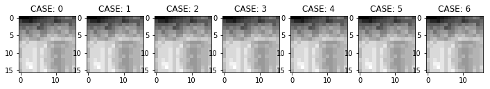


# METRICS

## Compare Methods
* Compression Ratio
    * The number of bits in the original image / Number of bits in the compressed image
* Bits/Pixel for the compressed image
    * Average number of bits per pixel in the compressed image
* RMS Error
    * Root-mean-square: the square root of the average of difference between a actual and predicted values, squared

### Compression Ratio


```python
def calculate_compression_ratio(original_image, encoded_string):
    orig_img_w, orig_img_h = original_image.shape
    num_pix_orig = orig_img_w * orig_img_h
    num_bits_orig = num_pix_orig * 8
    num_bits_recreate = len(encoded_string)
    comp_ratio = num_bits_orig / num_bits_recreate
    return comp_ratio
```


```python
i = 0
metrics_cr_list = []
for i_BS in bin_string_list:
    compression_ratio = calculate_compression_ratio(original_image, i_BS)
    metrics_cr_list.append(compression_ratio)
    print("Case:", i, ": ", compression_ratio)
    i += 1
```

    Case: 0 :  2.6357786357786357
    Case: 1 :  2.5924050632911393
    Case: 2 :  2.1580611169652264
    Case: 3 :  2.563204005006258
    Case: 4 :  1.6463022508038585
    Case: 5 :  1.72681281618887
    Case: 6 :  1.7746967071057191


### Average Bits/Pixel


```python
def calculate_avg_bitsPerPix(original_image, encoded_string):
    img_w, img_h = original_image.shape
    num_pix = img_w * img_h
    num_bits = len(encoded_string)
    avg_bitsPerPix = num_bits / num_pix
    return avg_bitsPerPix
```


```python
i = 0
metrics_bitsPix_list = []
for i_BS in bin_string_list:
    recreated_img = reImg_list[i]
    avg_bitsPerPix = calculate_avg_bitsPerPix(recreated_img, i_BS)
    metrics_bitsPix_list.append(avg_bitsPerPix)
    print("Case:", i, ": ", avg_bitsPerPix)
    i += 1
```

    Case: 0 :  3.03515625
    Case: 1 :  3.0859375
    Case: 2 :  3.70703125
    Case: 3 :  3.12109375
    Case: 4 :  4.859375
    Case: 5 :  4.6328125
    Case: 6 :  4.5078125


### RMS Error
If performed correctly, this should be 0 for all values (since we're doing lossless compression)


```python
def calulate_RMS_error(original_image, recreated_img):
    diff_list_squared = []
    row, column = original_image.shape
    i = 0
    while i < row:
        j = 0
        while j < column:
            img_val = original_image[i][j]
            re_val = recreated_img[i][j]
            diff = img_val - re_val
            diff_squared = diff**2
            diff_list_squared.append(diff_squared)
            j += 1
        i += 1
    num_vals = len(diff_list_squared)
    sum_vals = sum(diff_list_squared)
    RMS_error = math.sqrt(sum_vals/num_vals)
    return RMS_error
            
```


```python
i = 0
metrics_rms_list = []
for i_img in reImg_list:
    val = calulate_RMS_error(original_image, i_img)
    metrics_rms_list.append(val)
    print("Case:", i, ": ", val)
    i += 1
```

    Case: 0 :  0.0
    Case: 1 :  0.0
    Case: 2 :  0.0
    Case: 3 :  0.0
    Case: 4 :  0.0
    Case: 5 :  0.0
    Case: 6 :  0.0


## The terminal output is a little difficult to visualize, let's plot them


```python
plt.figure()

full_case_tups_list = []
i = 0
cr_tup_list = []
metrics = ['CR', 'Avg', 'RMS']
# create compression ratio
for case_i in cases:
    cur_tup = (case_i, metrics_cr_list[i])
    cr_tup_list.append(cur_tup)
    i += 1
full_case_tups_list.append(cr_tup_list)

# create Average Bits/Pixel
i = 0
avg_tup_list = []
for case_i in cases:
    cur_tup = (case_i, metrics_bitsPix_list[i])
    avg_tup_list.append(cur_tup)
    i += 1
full_case_tups_list.append(avg_tup_list)

# create RMS
i = 0
rms_tup_list = []
for case_i in cases:
    cur_tup = (case_i, metrics_rms_list[i])
    rms_tup_list.append(cur_tup)
    i += 1
full_case_tups_list.append(rms_tup_list)

for tuple_metric_line in full_case_tups_list:
    plt.plot(*zip(*tuple_metric_line), '-o')

plt.title('Predictor Methods')
plt.ylabel('value')
plt.xlabel('case')
plt.legend(metrics, loc='upper left')
plt.show()
```


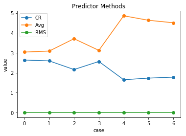


# Discussion

As shown above; 
* the RMS error is 0 for all cases
* the compression ratio and average bits/pixel are inversely related
    * this is what we'd expect in this case, as the number of bits/pixel increase the compression ratio should decrease (it is 'less' compressed).

## Where do these different predictor functions perform well, where don't they?
Let's create some new images and explore the different methods

### create new images


```python
img_width = 16
img_height = 16

new_imgs_vals = []
new_img_labels = []

VStriped_image = np.zeros((img_width, img_height))
i = 0
even_odd = 0
while i < img_width:
    j = 0
    while j < img_height:
        if even_odd % 2 == 0:
            VStriped_image[i][j] = 20
        else:
            VStriped_image[i][j] = 40
        even_odd += 1
        j += 1
    i += 1
new_imgs_vals.append(VStriped_image)
new_img_labels.append('VStriped')
    
checkered_image = np.zeros((img_width, img_height))
i = 0
even_odd = 0
row_flag = True
while i < img_width:
    j = 0
    while j < img_height:
        if even_odd % 2 == 0:
            if row_flag:
                checkered_image[i][j] = 35
            else:
                checkered_image[i][j] = 30
        else:
            if not row_flag:
                checkered_image[i][j] = 35
            else:
                checkered_image[i][j] = 30
        even_odd += 1
        j += 1
    row_flag = not row_flag
    i += 1
new_imgs_vals.append(checkered_image)
new_img_labels.append('checkered')
    
    
RL_gradient_image = np.zeros((img_width, img_height))
i = 0
# 50 is an arbitrary start value
s_val = 50
while i < img_width:
    r_val = s_val
    j = 0
    while j < img_height:
        r_val += 1
        RL_gradient_image[i][j] = r_val
        j += 1
    i += 1
new_imgs_vals.append(RL_gradient_image)
new_img_labels.append('RL_grad')    

TDRL_gradient_image = np.zeros((img_width, img_height))
i = 0
s_val = 50
while i < img_width:
    r_val = s_val
    j = 0
    while j < img_height:
        r_val += 1
        TDRL_gradient_image[i][j] = r_val
        j += 1
    i += 1
    s_val += 1
# plt.imshow(checkered_image, cmap='gray')
new_imgs_vals.append(TDRL_gradient_image)
new_img_labels.append('TDRL_grad')    

```


```python
create_array_figure(new_imgs_vals, new_img_labels)
```


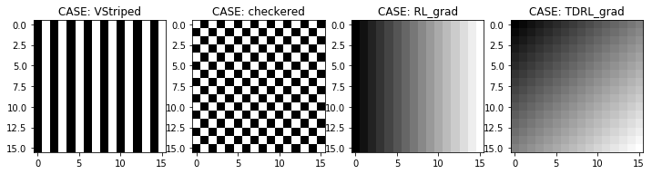


## Compute metrics for the new cases


```python
def calculate_all_metics_wrapper(original_image, recreated_img, reImg_list, bin_string_list):
    i = 0
    metrics_rms_list = []
    for i_img in reImg_list:
        val = calulate_RMS_error(original_image, i_img)
        metrics_rms_list.append(val)
        # print("Case:", i, ": ", val)
        i += 1
    
    i = 0
    metrics_bitsPix_list = []
    for i_BS in bin_string_list:
        recreated_img = reImg_list[i]
        avg_bitsPerPix = calculate_avg_bitsPerPix(recreated_img, i_BS)
        metrics_bitsPix_list.append(avg_bitsPerPix)
        # print("Case:", i, ": ", avg_bitsPerPix)
        i += 1
        
    i = 0
    metrics_cr_list = []
    for i_BS in bin_string_list:
        compression_ratio = calculate_compression_ratio(original_image, i_BS)
        metrics_cr_list.append(compression_ratio)
        # print("Case:", i, ": ", compression_ratio)
        i += 1
    return metrics_rms_list, metrics_bitsPix_list, metrics_cr_list
```


```python
# STRIPPED IMAGE
# original image shape is retained
def calculate_new_metrics_display_plot(current_new_img):
    img_width, img_height = VStriped_image.shape
    huffman_dict = create_bin_dict(22)
    huffman_dict_rev = {val: key for key, val in huffman_dict.items()}
    cases = [0, 1, 2, 3, 4, 5, 6]
    diff_matrix_list = []
    bin_string_list = []
    reImg_list = []
    for cur_case in cases:
        diff_matrix_cur = create_differences_matrix_with_case(current_new_img, cur_case)
        diff_matrix_list.append(diff_matrix_cur)

        encoded_string_cur = encode_diffMatrix(diff_matrix_cur, huffman_dict)
        bin_string_list.append(encoded_string_cur)

        re_img_cur = decode_binaryString_to_diff_matrix(encoded_string_cur, img_width, img_height, huffman_dict_rev, cur_case)
        reImg_list.append(re_img_cur)
    metrics_rms_list, metrics_bitsPix_list, metrics_cr_list = calculate_all_metics_wrapper(current_new_img, recreated_img, reImg_list, bin_string_list)
    plt.figure()

    full_case_tups_list = []
    i = 0
    cr_tup_list = []
    metrics = ['CR', 'Avg', 'RMS']
    # create compression ratio
    for case_i in cases:
        cur_tup = (case_i, metrics_cr_list[i])
        cr_tup_list.append(cur_tup)
        i += 1
    full_case_tups_list.append(cr_tup_list)

    # create Average Bits/Pixel
    i = 0
    avg_tup_list = []
    for case_i in cases:
        cur_tup = (case_i, metrics_bitsPix_list[i])
        avg_tup_list.append(cur_tup)
        i += 1
    full_case_tups_list.append(avg_tup_list)

    # create RMS
    i = 0
    rms_tup_list = []
    for case_i in cases:
        cur_tup = (case_i, metrics_rms_list[i])
        rms_tup_list.append(cur_tup)
        i += 1
    full_case_tups_list.append(rms_tup_list)

    for tuple_metric_line in full_case_tups_list:
        plt.plot(*zip(*tuple_metric_line), '-o')

    plt.title('Predictor Methods')
    plt.ylabel('value')
    plt.xlabel('case')
    plt.legend(metrics, loc='upper left')
    plt.show()
```

## Visualizing the metrics for each predictor for each new case


```python
case_index = 0
for new_img in new_imgs_vals:
    print("IMAGE: ", new_img_labels[case_index])
    calculate_new_metrics_display_plot(new_img)
    case_index += 1
```

    IMAGE:  VStriped


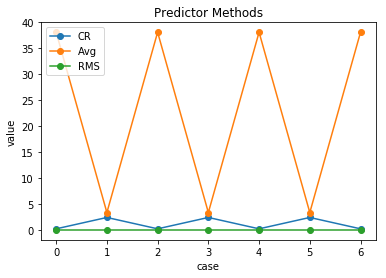


    IMAGE:  checkered


    IMAGE:  RL_grad


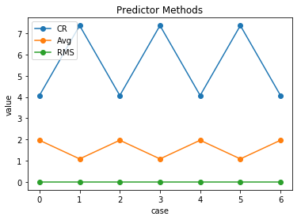


    IMAGE:  TDRL_grad


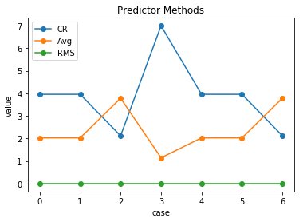


## There's a lot going on, let's look a little deeper

We'll first look at the checkered case;

looking at the checkered, let's lee what happens if we alter *how* checkered/different the values are

We should, in theory, see the same pattern as above but the chart will be 'expanded' on the vertical axis -- meaning the more checkered the values, the worse the compression is.

### Note:
Look how well case 2 is performing for checkered -- this is because in this case our predictor value is based on 'C'. which is the diagonal value = in the checker board, the diagonal value doesn't change meaning the difference is zero so in case 2 we only have to encode a small value


```python
img_width = 16
img_height = 16

new_imgs_vals = []
new_img_labels = []

# create small checkered; diff = 1
checkered_image = np.zeros((img_width, img_height))
i = 0
even_odd = 0
row_flag = True
while i < img_width:
    j = 0
    while j < img_height:
        if even_odd % 2 == 0:
            if row_flag:
                checkered_image[i][j] = 35
            else:
                checkered_image[i][j] = 36
        else:
            if not row_flag:
                checkered_image[i][j] = 35
            else:
                checkered_image[i][j] = 36
        even_odd += 1
        j += 1
    row_flag = not row_flag
    i += 1
new_imgs_vals.append(checkered_image)
new_img_labels.append('checkered_1')

# create medium checkered; diff = 2
checkered_image = np.zeros((img_width, img_height))
i = 0
even_odd = 0
row_flag = True
while i < img_width:
    j = 0
    while j < img_height:
        if even_odd % 2 == 0:
            if row_flag:
                checkered_image[i][j] = 35
            else:
                checkered_image[i][j] = 37
        else:
            if not row_flag:
                checkered_image[i][j] = 35
            else:
                checkered_image[i][j] = 37
        even_odd += 1
        j += 1
    row_flag = not row_flag
    i += 1
new_imgs_vals.append(checkered_image)
new_img_labels.append('checkered_2')


# create high checkered; diff = 5
checkered_image = np.zeros((img_width, img_height))
i = 0
even_odd = 0
row_flag = True
while i < img_width:
    j = 0
    while j < img_height:
        if even_odd % 2 == 0:
            if row_flag:
                checkered_image[i][j] = 35
            else:
                checkered_image[i][j] = 40
        else:
            if not row_flag:
                checkered_image[i][j] = 35
            else:
                checkered_image[i][j] = 40
        even_odd += 1
        j += 1
    row_flag = not row_flag
    i += 1
new_imgs_vals.append(checkered_image)
new_img_labels.append('checkered_5')

case_index = 0
for new_img in new_imgs_vals:
    print("IMAGE: ", new_img_labels[case_index])
    calculate_new_metrics_display_plot(new_img)
    case_index += 1
```

    IMAGE:  checkered_1


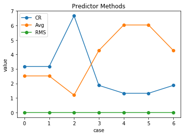


    IMAGE:  checkered_2


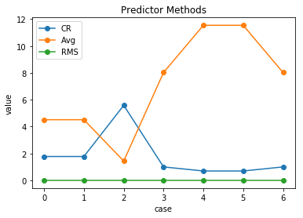


    IMAGE:  checkered_5


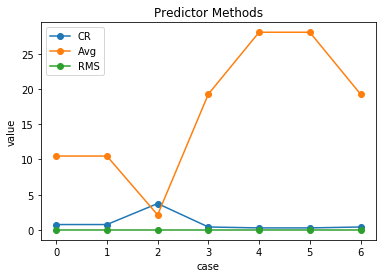


Exactly what we expected.

### By this logic, would we see a similar trend for the vertical stripped image?
Yes, let's check, the best case here _should_ be the cases where B has the most influence `CASE 1,3,5` since all values in the column are the same


```python
img_width = 16
img_height = 16

new_imgs_vals = []
new_img_labels = []

# create small v_stiped; diff = 1
VStriped_image = np.zeros((img_width, img_height))
i = 0
even_odd = 0
while i < img_width:
    j = 0
    while j < img_height:
        if even_odd % 2 == 0:
            VStriped_image[i][j] = 20
        else:
            VStriped_image[i][j] = 21
        even_odd += 1
        j += 1
    i += 1
new_imgs_vals.append(VStriped_image)
new_img_labels.append('VStriped_1')

# create medium v_stiped; diff = 2
VStriped_image = np.zeros((img_width, img_height))
i = 0
even_odd = 0
while i < img_width:
    j = 0
    while j < img_height:
        if even_odd % 2 == 0:
            VStriped_image[i][j] = 20
        else:
            VStriped_image[i][j] = 22
        even_odd += 1
        j += 1
    i += 1
new_imgs_vals.append(VStriped_image)
new_img_labels.append('VStriped_2')


# create high v_stiped; diff = 5
VStriped_image = np.zeros((img_width, img_height))
i = 0
even_odd = 0
while i < img_width:
    j = 0
    while j < img_height:
        if even_odd % 2 == 0:
            VStriped_image[i][j] = 20
        else:
            VStriped_image[i][j] = 25
        even_odd += 1
        j += 1
    i += 1
new_imgs_vals.append(VStriped_image)
new_img_labels.append('VStriped_5')

case_index = 0
for new_img in new_imgs_vals:
    print("IMAGE: ", new_img_labels[case_index])
    calculate_new_metrics_display_plot(new_img)
    case_index += 1
```

    IMAGE:  VStriped_1


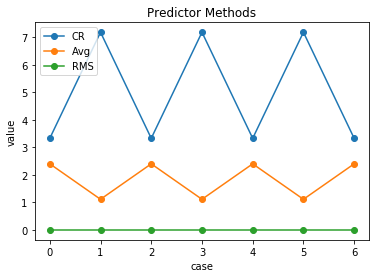


    IMAGE:  VStriped_2


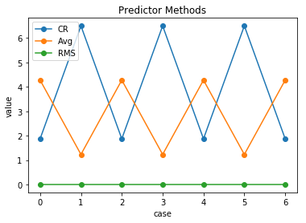


    IMAGE:  VStriped_5


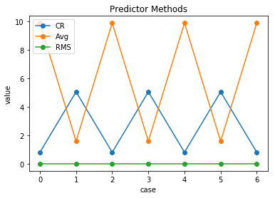


Pretty cool, no?  The compression is better when the differences are smaller and performs best in cases where the `B` value plays a heavy role == `case 1, 3, 5`

# This has been fun, but why do I care?
Well, you know that notification you get when you run out of storage? ......

Right, so compression does have real world applications.  
* Let's pretend you have a 1GB image
* Let's then pretend that using one of the predictor equations you have a compression ratio of 2 (this is conservative)
your compressed image (that is completely still unaltered when decoded) is now is now half the original size!
* That 1GB image is now 0.5GB!

### What next?
There are many, many concepts not covered here -- color mapping, determining which predictor, encoding the image size, encoding scheme, lossy/lossless, .....


```python

```
