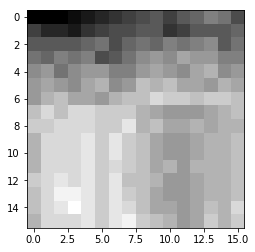
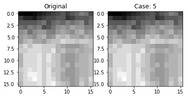
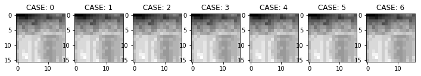

Jack Burdick

# JPEG Project


## Project Information


## Overview

### Imports
We'll need:
1. numpy
    * matrix manipulations
2. skimage
    * view the image
3. matplotlib
    * creating figures


```python
import numpy as np
from skimage import io
from matplotlib import pyplot as plt
%matplotlib inline
```


```python
input_image_asTXT_path = './image_input.txt'
```

### Read in original image from txt file (received format) and convert image to numpy array


```python
def create_image_matrix(input_image_asTXT_path, img_height, img_width):
    original_image = np.zeros((img_width, img_height))
    # fill empty matrix with specified values
    with open(input_image_asTXT_path) as inVals:
        img_row = []
        row_num = 0
        for line in inVals:
            line = line.strip("\n")
            line_list = line.split(" ")
            line_l_clean = [int(val.strip(" ")) for val in line_list if val != ""]
            # print(line_l_clean)
            original_image[row_num] = line_l_clean
            row_num += 1
    return original_image
```


```python
original_image = create_image_matrix(input_image_asTXT_path, 16, 16)
```

#### View raw image values to ensure we've captured them correctly


```python
# print raw matrix values
print(original_image)
# print shape
print(original_image.shape)
```

    [[  88.   88.   88.   89.   90.   91.   92.   93.   94.   95.   93.   95.
        96.   98.   97.   94.]
     [  93.   91.   91.   90.   92.   93.   94.   94.   95.   95.   92.   93.
        95.   95.   95.   96.]
     [  95.   95.   95.   95.   96.   97.   94.   96.   97.   96.   98.   97.
        98.   99.   95.   97.]
     [  97.   96.   98.   97.   98.   94.   95.   97.   99.  100.   99.  101.
       100.  100.   98.   98.]
     [  99.  100.   97.   99.  100.  100.   98.   98.  100.  101.  100.   99.
       101.  102.   99.  100.]
     [ 100.  101.  100.   99.  101.  102.   99.  100.  103.  102.  103.  101.
       101.  100.  102.  101.]
     [ 100.  102.  103.  101.  101.  100.  102.  103.  103.  105.  104.  104.
       103.  104.  104.  103.]
     [ 103.  105.  103.  105.  105.  104.  104.  104.  102.  101.  100.  100.
       100.  101.  102.  103.]
     [ 104.  104.  105.  105.  105.  104.  104.  106.  102.  103.  101.  101.
       102.  101.  102.  102.]
     [ 102.  105.  105.  105.  106.  104.  106.  104.  103.  101.  100.  100.
       101.  102.  102.  103.]
     [ 102.  105.  105.  105.  106.  104.  106.  104.  103.  101.  100.  100.
       101.  102.  102.  103.]
     [ 102.  105.  105.  105.  106.  104.  105.  104.  103.  101.  102.  100.
       102.  102.  102.  103.]
     [ 104.  105.  106.  105.  106.  104.  106.  103.  103.  102.  100.  100.
       101.  102.  102.  103.]
     [ 103.  105.  107.  107.  106.  104.  106.  104.  103.  101.  100.  100.
       101.  102.  102.  103.]
     [ 103.  105.  106.  108.  106.  104.  106.  105.  103.  101.  101.  100.
       101.  103.  102.  105.]
     [ 102.  105.  105.  105.  106.  104.  106.  107.  104.  103.  102.  100.
       101.  104.  102.  104.]]
    (16, 16)


Everything looks good here; it matches the expected values from the input txt file.

#### Inspect grayscale image to satisfy curiousity


```python
plt.imshow(original_image, cmap='gray')
```


    <matplotlib.image.AxesImage at 0x114f725f8>





A little less excting than I was hoping for.. but let's move on

## Predictor Calculations
### Given: 7 predictor equations
### Plan
* Input
    * Image matrix of raw values
        * `original_image`
        * `CASE`
* Implementation
    * Create a function (`prediction_generator()`) that generates the predicted value, given A,B,C, the current value, and the specified case
    * Given the above function, create a function (`create_differences_matrix_with_case()`) that, using a parameter flag, uses the specified predictor and outputs the predicted value
* Output
    * A Matrix of the difference values


```python
def prediction_generator(cur_val, case, values):
    A = values[0]
    B = values[1]
    C = values[2]

    # this flag will go high when there is potential for a float value difference to be generated
    float_flag = False

    if(case == 0):
        val_not = A
    elif(case == 1):
        val_not = B
    elif(case == 2):
        val_not = C
    elif(case == 3):
        val_not = A + B - C
    elif(case == 4):
        val_not = A + ((B - C)/2)
        float_flag = True
    elif(case == 5):
        val_not = B + ((A - C)/2)
        float_flag = True
    elif(case == 6):
        val_not = (A + B)/2
        float_flag = True
    else:
        print("we didn't plan for this....")

    diff = cur_val - val_not

    # to account for the float, we will multiply all values
    # for the specific case by 2 to ensure we return an integer
    # this will be important when encoding/decoding
    if float_flag:
        # pass
        diff_double = diff * 2
        diff = diff_double
    return diff
```

### Special considerations
The first column and first row of the images require 'special treatment'.
* The first row doesn't have a value above it (B)
* The first column doesn't have a value to the left of it (A)
* Neither the first column, nor the first row, have a value to the upper left of them (C)

This will be taken into account (as shown in the above function) by implementing independent functions for the first row and first column


```python
# handle the first row of the image values
def get_pred_row_1(row, cur_col):
    # pred = current - (A)left
    A_val = row[cur_col - 1]
    x_val = row[cur_col]
    pred = x_val - A_val
    # DEBUGGING: print statement showing pred calc
    # print("A(", A_val, ")", "-", "cur(", x_val, ")", " = ", pred)
    return pred
```


```python
# handle the first column of the image values
def get_pred_col_1(cur_row, cur_col, original_image):
    # pred = current - (B)above
    B_val = original_image[cur_row-1][cur_col]
    x_val = original_image[cur_row][cur_col]
    pred = x_val - B_val
    # DEBUGGING: print statement showing pred calc
    # print("cur(", x_val, ")", "-", "B(", B_val, ")", " = ", pred)
    return pred
```


```python
# create prediction matrix
# this uses the prediction_generator to get each value
def create_differences_matrix_with_case(original_image, case):

    # create difference matrix
    img_width, img_height = original_image.shape 
    diff_matrix = np.zeros((img_width, img_height))
    
    # index values
    cur_row = 0
    cur_col = 0

    # copy first value
    diff_matrix[cur_row][cur_col] = original_image[cur_row][cur_col]
    # loop rows in the image
    for row in original_image:
        # first row is a special case
        if cur_row == 0:
            cur_col = 0
            for col_val in row:
                # the first value is already copied
                if cur_col != 0:
                    value = get_pred_row_1(row, cur_col)
                    diff_matrix[cur_row][cur_col] = value
                cur_col += 1
        else:
            cur_col = 0
            for col_val in row:
                if cur_col == 0:
                    diff_value = get_pred_col_1(cur_row,
                                                cur_col,
                                                original_image)
                    diff_matrix[cur_row][cur_col] = diff_value
                else:
                    # Main implementation (first row/col have been calculated)
                    # get prediction according to case
                    current_val = original_image[cur_row][cur_col]
                    A = original_image[cur_row][cur_col-1]
                    B = original_image[cur_row-1][cur_col]
                    C = original_image[cur_row-1][cur_col-1]
                    values = [A, B, C]
                    diff_value = prediction_generator(current_val,
                                                      case,
                                                      values)
                    diff_matrix[cur_row][cur_col] = diff_value
                cur_col += 1
        cur_row += 1
    return diff_matrix
```

### Test that our difference matrix is being generated


```python
diff_matrix = create_differences_matrix_with_case(original_image, 0)
print(diff_matrix)
```

    [[ 88.   0.   0.   1.   1.   1.   1.   1.   1.   1.  -2.   2.   1.   2.
       -1.  -3.]
     [  5.  -2.   0.  -1.   2.   1.   1.   0.   1.   0.  -3.   1.   2.   0.
        0.   1.]
     [  2.   0.   0.   0.   1.   1.  -3.   2.   1.  -1.   2.  -1.   1.   1.
       -4.   2.]
     [  2.  -1.   2.  -1.   1.  -4.   1.   2.   2.   1.  -1.   2.  -1.   0.
       -2.   0.]
     [  2.   1.  -3.   2.   1.   0.  -2.   0.   2.   1.  -1.  -1.   2.   1.
       -3.   1.]
     [  1.   1.  -1.  -1.   2.   1.  -3.   1.   3.  -1.   1.  -2.   0.  -1.
        2.  -1.]
     [  0.   2.   1.  -2.   0.  -1.   2.   1.   0.   2.  -1.   0.  -1.   1.
        0.  -1.]
     [  3.   2.  -2.   2.   0.  -1.   0.   0.  -2.  -1.  -1.   0.   0.   1.
        1.   1.]
     [  1.   0.   1.   0.   0.  -1.   0.   2.  -4.   1.  -2.   0.   1.  -1.
        1.   0.]
     [ -2.   3.   0.   0.   1.  -2.   2.  -2.  -1.  -2.  -1.   0.   1.   1.
        0.   1.]
     [  0.   3.   0.   0.   1.  -2.   2.  -2.  -1.  -2.  -1.   0.   1.   1.
        0.   1.]
     [  0.   3.   0.   0.   1.  -2.   1.  -1.  -1.  -2.   1.  -2.   2.   0.
        0.   1.]
     [  2.   1.   1.  -1.   1.  -2.   2.  -3.   0.  -1.  -2.   0.   1.   1.
        0.   1.]
     [ -1.   2.   2.   0.  -1.  -2.   2.  -2.  -1.  -2.  -1.   0.   1.   1.
        0.   1.]
     [  0.   2.   1.   2.  -2.  -2.   2.  -1.  -2.  -2.   0.  -1.   1.   2.
       -1.   3.]
     [ -1.   3.   0.   0.   1.  -2.   2.   1.  -3.  -1.  -1.  -2.   1.   3.
       -2.   2.]]


This looks good. How about for the cases when a float value could be created?


```python
diff_matrix = create_differences_matrix_with_case(original_image, 5)
print(diff_matrix)
```

    [[ 88.   0.   0.   1.   1.   1.   1.   1.   1.   1.  -2.   2.   1.   2.
       -1.  -3.]
     [  5.   1.   3.  -1.   3.   2.   2.   0.   1.  -1.  -2.  -3.   0.  -5.
       -1.   6.]
     [  2.   6.   4.   6.   3.   4.  -4.   4.   2.   0.  11.   2.   2.   5.
       -4.   2.]
     [  2.   0.   5.   1.   2.  -8.   5.   1.   3.   6.  -2.   7.   0.   0.
        5.  -1.]
     [  2.   6.  -6.   5.   2.  10.   0.  -1.   1.   1.   1.  -5.   4.   3.
        0.   3.]
     [  1.   1.   5.  -3.   2.   3.   0.   3.   4.  -1.   5.   1.  -2.  -4.
        8.  -1.]
     [  0.   2.   5.   1.  -2.  -4.   8.   3.  -3.   6.  -1.   5.   1.   6.
        0.   2.]
     [  3.   3.  -3.   8.   4.   4.   0.   0.  -3.  -7.  -4.  -4.  -2.  -3.
       -1.   2.]
     [  1.  -3.   5.  -2.   0.   0.   0.   4.  -2.   4.   0.   1.   3.  -2.
        0.  -2.]
     [ -2.   4.  -1.   0.   2.  -1.   4.  -6.   4.  -5.   0.  -1.  -1.   3.
       -1.   2.]
     [  0.   0.   0.   0.   0.   0.   0.   0.   0.   0.   0.   0.   0.   0.
        0.   0.]
     [  0.   0.   0.   0.   0.   0.  -2.   1.   0.   0.   4.  -2.   2.  -1.
        0.   0.]
     [  2.  -2.   2.  -1.   0.   0.   2.  -3.   1.   2.  -5.   2.  -2.   1.
        0.   0.]
     [ -1.   1.   2.   3.  -2.   0.   0.   2.  -1.  -2.   1.   0.   0.   0.
        0.   0.]
     [  0.   0.  -2.   3.  -1.   0.   0.   2.  -1.   0.   2.  -1.   0.   2.
       -1.   4.]
     [ -1.   1.  -2.  -5.   3.   0.   0.   4.   0.   3.   0.  -1.   0.   2.
       -1.  -2.]]


It's working as intended.. note that the values go much higher here.. in one case the value is 11!
This is much higher than the given huffman decoding values (+/- 6). For this reason, we'll have to expand on the encoding/decoding scheme

#### Overview to expand on the encoding/decoding scheme
1. View the current encoding/decoding scheme
2. Ensure reproducible pattern exists (it should, it's huffman encoding)
3. Create a custom function to expand on this
4. Test function


```python
# step 1
huffan_lookup_txt_path = './huffman_tb_dx_input.txt'
test_huffman_dict = {}
with open(huffan_lookup_txt_path) as lookupVals:
    for line in lookupVals:
        line = line.strip("\n")
        cur_pair = line.split(",")
        cur_key = int(cur_pair[0])
        cur_val = cur_pair[1]
        test_huffman_dict[cur_key] = cur_val

# step 2
print(test_huffman_dict)
```

    {0: '1', 1: '00', 2: '0100', 3: '010100', 4: '01010100', 5: '0101010100', 6: '010101010100', -2: '01011', -6: '0101010101011', -5: '01010101011', -4: '010101011', -3: '0101011', -1: '011'}


```python
# step 3
def create_bin_dict(MAX_LEN):
    created_dict = {}
    created_dict['0'] = '1'
    max_len = MAX_LEN
    # add positives
    pos_end_string = '00'
    val = 0
    while val <= max_len:
        cur_string = ''
        i = 0
        while i < val:
            cur_string += '01'
            i += 1
        val += 1
        cur_string += pos_end_string
        created_dict[str(val)] = cur_string
        # print("val: ", val, "string: \t", cur_string)

    # add negatives
    neg_end_string = '1'
    val = -0
    while val >= -max_len:
        cur_string = ''
        i = 0
        while i >= val:
            cur_string += '01'
            i -= 1
        val -= 1
        cur_string += neg_end_string
        created_dict[str(val)] = cur_string
        # print("-val: ", val, "string: \t", cur_string)
    return created_dict

# step 4
# we'll be using 22 as the max length because I know this will handle all cases for the given image
huffman_dict = create_bin_dict(22)
print(huffman_dict)
```

    {'-11': '01010101010101010101011', '-5': '01010101011', '1': '00', '-3': '0101011', '-22': '010101010101010101010101010101010101010101011', '5': '0101010100', '3': '010100', '6': '010101010100', '9': '010101010101010100', '-12': '0101010101010101010101011', '12': '010101010101010101010100', '-6': '0101010101011', '18': '010101010101010101010101010101010100', '-2': '01011', '-10': '010101010101010101011', '2': '0100', '23': '0101010101010101010101010101010101010101010100', '17': '0101010101010101010101010101010100', '-4': '010101011', '22': '01010101010101010101010101010101010101010100', '21': '010101010101010101010101010101010101010100', '7': '01010101010100', '-21': '0101010101010101010101010101010101010101011', '-16': '010101010101010101010101010101011', '19': '01010101010101010101010101010101010100', '-14': '01010101010101010101010101011', '-23': '01010101010101010101010101010101010101010101011', '4': '01010100', '14': '0101010101010101010101010100', '10': '01010101010101010100', '20': '0101010101010101010101010101010101010100', '15': '010101010101010101010101010100', '-19': '010101010101010101010101010101010101011', '-1': '011', '-15': '0101010101010101010101010101011', '-9': '0101010101010101011', '16': '01010101010101010101010101010100', '0': '1', '-18': '0101010101010101010101010101010101011', '13': '01010101010101010101010100', '11': '0101010101010101010100', '8': '0101010101010100', '-13': '010101010101010101010101011', '-7': '010101010101011', '-17': '01010101010101010101010101010101011', '-20': '01010101010101010101010101010101010101011', '-8': '01010101010101011'}


##### NOTE: 
Rather than create a new dictionary for each value, based on the max absolute difference value, we will create a single globally scoped `huffman_dict` that we can access.  This would not scale well, but creating the trivial and isn't important to this report

### Problem:
Though the dictionary works well for converting an int to binary string, We also need to be able to convert the first value in the matrix to a binary string.  This first value is always 8 bits.  Rather than hard code this we'll use a python conversion


```python
# test binary converstion
test_bin_int = 67
test_bin_string = '{0:08b}'.format(test_bin_int)
print(test_bin_string)
```

    01000011


Nice, that' works; `67` in binary is `01000011`
We'll need this for our next function

# Overview: where are we so far
Right now we have:
* Image Matrix
    * `original_image`
* Predicted values -> Difference Matrix
    * `diff_matrix`
* An encoding scheme
    * `huffman_dict`

# What's next
1. Encode to binary string
    * The 'heavy lifting' is already done here
2. Decode back to original image
    * Essentially just reverse what we've already done
3. Test all cases and make sure all image values are stored
    * Since we're passing everything as flags/values, we should be able to easily test all cases
4. Compare/contrast methods
    * Better get some popcorn, this is bound to be a thriller


```python
# given the diff_matrix and encoding scheme, we can quickly create the binary string
def encode_diffMatrix(diff_matrix, huffman_dict):
    # loop through image
    row_ind = 0
    # col_index = 0
    encoded_string = ""
    for row in diff_matrix:
        col_index = 0
        for col_val in row:
            if row_ind == 0 and col_index == 0:
                # this is where the above conversion comes in handy
                val_int = int(diff_matrix[row_ind][col_index])
                encoded_value = '{0:08b}'.format(val_int)
            else:
                cur_val = diff_matrix[row_ind][col_index]
                encoded_value = huffman_dict[str(int(cur_val))]
            encoded_string += encoded_value
            col_index += 1
        row_ind += 1
    return encoded_string
```


```python
# test to ensure we're creating a string
encoded_string = encode_diffMatrix(diff_matrix, huffman_dict)
print(encoded_string)
```

    0101100011000000000000000101101000001000110101011010101010000010100011010100010001001000110101101010111010101010110110101010101000100010101010100010101000101010101000101000101010001010101101010100010010101010101010101010100010001000101010100010101011010001001010101010000010001010101010101011010101010000010100010101010100010110101010101010011010101010001101000101010101000101010101011010101010001000101010101010101010010110000000101010101101010100010100101010000000101010100010101101000101001010100010101000110101010100000101101010101101010101010101000111010001010101000001011010101011010101010101010001010001010110101010101000110101010100000101010101001010001010001010001010110101010101010100010101000101010011010101101010101010101101010101101010101101011010101101101000001010110101010100010111110101010001011010101001000101000101110101101011010101000111010001101010100010101010101101010100010101010111011011010100011010011111111111111111111110101100110101010001011010001111010001011010001111010001010110001000101010101101000101100110110001000101000101111010001101011001111111010110101000111101000111010001110100011010101000110001011010101010110101001101010100101010010111010001101011


## From binary string to JPEG
Now that we've converted to a binary string we have to start the process of decoding a binary string to a JPEG image.

### Plan:
1. Write a single function that
    * takes inputs:
        * binary encoded string
        * target image width and height
        * a decoding dictionary scheme
        * the case (reverse predictor to use)
    * Returns:
        * image matrix
        
Note, we want to ensure we don't pass the original image (we are 'recreating' it from the binary string).

### Note:
Since this decoding is identical to encoding (only in reverse) I will not be explaining every step in detail.  If you have questions about this, please feel free to email me

#### First
1. we have to create a reverse dictionary that is the same as the current dictionary, only in reverse since we now want to go from binary to int
2. we'll need special functions to handle the first column and first rows again

#### reverse huffman dict


```python
huffman_dict_rev = {val: key for key, val in huffman_dict.items()}
```

#### Get image height and width from the original image (ideally this would be encoded in the string)


```python
img_width, img_height = original_image.shape
print(img_width, img_height)
```

    16 16


```python
# Calculated decoded value according to our 7 cases
def decode_val_from_case(case, row_index, col_index, created_dif_matrix, img_frm_decoded):
    
    cur_diff = created_dif_matrix[row_index][col_index]

    A = img_frm_decoded[row_index][col_index-1]
    B = img_frm_decoded[row_index-1][col_index]
    C = img_frm_decoded[row_index-1][col_index-1]

    float_flag = False
    if(case == 0):
        cmp_val = A
    elif(case == 1):
        cmp_val = B
    elif(case == 2):
        cmp_val = C
    elif(case == 3):
        cmp_val = A + B - C
    elif(case == 4):
        cmp_val = A + ((B - C)/2)
        float_flag = True
    elif(case == 5):
        cmp_val = B + ((A - C)/2)
        float_flag = True
    elif(case == 6):
        cmp_val = (A + B)/2
        float_flag = True
    else:
        print("we didn't plan for this....")

    if float_flag:
        cur_diff /= 2

    new_val = cmp_val + cur_diff
    # print(new_val)
    return new_val
```


```python
def decode_first_row_val(cur_index, created_dif_matrix, img_frm_decoded):
    # new_val = left(A) + diff
    cur_diff = created_dif_matrix[0][cur_index]
    A_val = img_frm_decoded[0][cur_index - 1]
    img_val = A_val + cur_diff
    return img_val
```


```python
def decode_first_col_val(cur_row_index, cur_col_index,
                         created_dif_matrix, img_frm_decoded):
    # new_val = above(B) + diff
    cur_diff = created_dif_matrix[cur_row_index][cur_col_index]
    B_val = img_frm_decoded[cur_row_index - 1][cur_col_index]
    img_val = B_val + cur_diff
    return img_val
```


```python
def decode_binaryString_to_diff_matrix(encoded_string,
                                       img_width,
                                       img_height,
                                       huffman_dict_rev,
                                       case):
    created_dif_matrix = np.zeros((img_width, img_height))
    i = 0
    cur_seq = ""
    first_num = encoded_string[:8]
    # convert to int
    first_img_val = int(first_num, 2)
    val_list = []
    val_list.append(first_img_val)
    img_values = encoded_string[8:]
    for bin_seq in img_values:
        cur_seq += bin_seq
        if cur_seq in huffman_dict_rev:
            val_int = huffman_dict_rev[cur_seq]
            # DEBUGGING: print statement to ensure conversion
            # print("#", i, ": ", cur_seq, " = ", val_int)
            val_list.append(int(val_int))
            cur_seq = ""
            i += 1

    cur_col_index = 0

    # recreate diff matrix
    img_row_index = 0
    img_col_index = 0
    for val in val_list:
        if img_col_index == img_width:
            img_row_index += 1
            img_col_index = 0
        created_dif_matrix[img_row_index][img_col_index % img_width] = val
        img_col_index += 1

    # Show that we've recreated the difference matrix
    # print("CREATED DIF MATRIX")
    # print(created_dif_matrix)

    # create first row in recreated img
    img_frm_decoded = np.zeros((img_width, img_height))
    img_frm_decoded[0][0] = created_dif_matrix[0][0]

    # loop through each row
    row_index = 0
    for diff_row in created_dif_matrix:
        col_index = 0
        # handle special case for first row
        if row_index == 0:
            # start at 1 since the first value is already handled
            col_index += 1
            while col_index < img_width:
                val = decode_first_row_val(col_index,
                                           created_dif_matrix,
                                           img_frm_decoded)
                img_frm_decoded[row_index][col_index] = val
                col_index += 1
        else:
            while col_index < img_width:
                if col_index == 0:
                    # handle special case first column value
                    val = decode_first_col_val(row_index, col_index,
                                               created_dif_matrix,
                                               img_frm_decoded)
                    img_frm_decoded[row_index][col_index] = val
                    col_index += 1
                else:
                    # Main implementation
                    val = decode_val_from_case(case,
                                               row_index, col_index,
                                               created_dif_matrix,
                                               img_frm_decoded)
                    img_frm_decoded[row_index][col_index] = val
                    col_index += 1
        row_index += 1

    return img_frm_decoded
```


```python
# test case
case = 5
test_re_created_img = decode_binaryString_to_diff_matrix(encoded_string,
                                       img_width,
                                       img_height,
                                       huffman_dict_rev,
                                       case)

# this should be a matrix that matches our original matrix
print(test_re_created_img)
```

    [[  88.   88.   88.   89.   90.   91.   92.   93.   94.   95.   93.   95.
        96.   98.   97.   94.]
     [  93.   91.   91.   90.   92.   93.   94.   94.   95.   95.   92.   93.
        95.   95.   95.   96.]
     [  95.   95.   95.   95.   96.   97.   94.   96.   97.   96.   98.   97.
        98.   99.   95.   97.]
     [  97.   96.   98.   97.   98.   94.   95.   97.   99.  100.   99.  101.
       100.  100.   98.   98.]
     [  99.  100.   97.   99.  100.  100.   98.   98.  100.  101.  100.   99.
       101.  102.   99.  100.]
     [ 100.  101.  100.   99.  101.  102.   99.  100.  103.  102.  103.  101.
       101.  100.  102.  101.]
     [ 100.  102.  103.  101.  101.  100.  102.  103.  103.  105.  104.  104.
       103.  104.  104.  103.]
     [ 103.  105.  103.  105.  105.  104.  104.  104.  102.  101.  100.  100.
       100.  101.  102.  103.]
     [ 104.  104.  105.  105.  105.  104.  104.  106.  102.  103.  101.  101.
       102.  101.  102.  102.]
     [ 102.  105.  105.  105.  106.  104.  106.  104.  103.  101.  100.  100.
       101.  102.  102.  103.]
     [ 102.  105.  105.  105.  106.  104.  106.  104.  103.  101.  100.  100.
       101.  102.  102.  103.]
     [ 102.  105.  105.  105.  106.  104.  105.  104.  103.  101.  102.  100.
       102.  102.  102.  103.]
     [ 104.  105.  106.  105.  106.  104.  106.  103.  103.  102.  100.  100.
       101.  102.  102.  103.]
     [ 103.  105.  107.  107.  106.  104.  106.  104.  103.  101.  100.  100.
       101.  102.  102.  103.]
     [ 103.  105.  106.  108.  106.  104.  106.  105.  103.  101.  101.  100.
       101.  103.  102.  105.]
     [ 102.  105.  105.  105.  106.  104.  106.  107.  104.  103.  102.  100.
       101.  104.  102.  104.]]


This looks similar, let's test it by comparing the two matrixes (original and recreated) in image representation


```python
def create_side_by_side_figure(original_image, recreated_img, CURCASE):
    # plt.figure(figsize=(6, 3))
    fig, axes = plt.subplots(1, 2, figsize=(6, 3))
    axes[0].imshow(original_image, cmap='gray')
    axes[0].set_title("Original")
    # plt.subplot(1, 2, 2)
    axes[1].imshow(recreated_img, cmap='gray')
    title = "Case: " + str(CURCASE)
    axes[1].set_title(title)
    plt.show()
```


```python
create_side_by_side_figure(original_image, test_re_created_img, case)
```





## They look the same!
This is good news, it means that for the given predictor method, we have succuessfully encoded and decoded the image

# We now need to wrap all of this into one function so we can show each step for each method


```python
# original image
original_image = create_image_matrix(input_image_asTXT_path, 16, 16)
img_width, img_height = original_image.shape

# encoding/decoding table
huffman_dict = create_bin_dict(22)
huffman_dict_rev = {val: key for key, val in huffman_dict.items()}

# cases are mapped to int values
cases = [0, 1, 2, 3, 4, 5, 6]

# hold all diff matrix for proof it worked
diff_matrix_list = []

# hold all binary encoded strings for proof/comparison
bin_string_list = []

# hold all the images to display later
reImg_list = []

# encode, then decode, each image, add img to `reImg_list`
for cur_case in cases:
    diff_matrix_cur = create_differences_matrix_with_case(original_image, cur_case)
    diff_matrix_list.append(diff_matrix_cur)
    
    encoded_string_cur = encode_diffMatrix(diff_matrix_cur, huffman_dict)
    bin_string_list.append(encoded_string_cur)
    
    re_img_cur = decode_binaryString_to_diff_matrix(encoded_string_cur, img_width, img_height, huffman_dict_rev, cur_case)
    reImg_list.append(re_img_cur)
```

## Difference Matrix: 
I'll print the second row of each diff matrix (saves on space but still shows it's been calculated).

##### Note: the second row is selected since the first row is identical in every case
If this works, all the matrixes should be ~different and the first value should be the same


```python
i = 0
for i_DM in diff_matrix_list:
    print("CASE: ", cases[i])
    print(i_DM[1])
    i += 1
```

    CASE:  0
    [ 5. -2.  0. -1.  2.  1.  1.  0.  1.  0. -3.  1.  2.  0.  0.  1.]
    CASE:  1
    [ 5.  3.  3.  1.  2.  2.  2.  1.  1.  0. -1. -2. -1. -3. -2.  2.]
    CASE:  2
    [ 5.  3.  3.  2.  3.  3.  3.  2.  2.  1. -3.  0.  0. -1. -3. -1.]
    CASE:  3
    [ 5. -2.  0. -2.  1.  0.  0. -1.  0. -1. -1. -1.  1. -2.  1.  4.]
    CASE:  4
    [ 5. -4.  0. -3.  3.  1.  1. -1.  1. -1. -4.  0.  3. -2.  1.  5.]
    CASE:  5
    [ 5.  1.  3. -1.  3.  2.  2.  0.  1. -1. -2. -3.  0. -5. -1.  6.]
    CASE:  6
    [ 5.  1.  3.  0.  4.  3.  3.  1.  2.  0. -4. -1.  1. -3. -2.  3.]


Everything looks like it should here

# Binary String:
I'll print each binary string (I'll compare them later)


```python
i = 0
for i_BS in bin_string_list:
    print("CASE: ", cases[i])
    print(i_BS)
    i += 1
```

    CASE:  0
    010110001100000000000000010110100000100011010101101010101000101110110100000010010101011000100110001001110000010101101000001101000110000010101011010001000110100011000101010110001000100000110100011101011101000001010110100001010111010000011011010000010101100000001101101000001010110001010001100010111011010001110100000101110110100001010001110110010110101000100010110100101111010110110111100000000100110111010001010101100010111000110010101101010011000101101000101101101011011100001001010100110001011010001011011010110111000010010101001100010110001101101011000101101001100010000000110001011010001010111011010111000010001101000100101101011010001011011010110111000010010100000100010110101101000110101101011101100010001101010001101010011000101101000001010110110110101100010100010110100
    CASE:  1
    0101100011000000000000000101101000001000110101011010101010001010001010000010001000100000010110101101101010110101101000100010101000101010001010101000101010001010100101000100000101010101000101010001010001010100100010000010100010001000101011000001000101010000010101000100000101000001000101010001101000100010101010100010100000000000101100010000010000000101001000100000100010100000101000100101011010100001000101000100101011010100010100101010000010100010001010100010001000101000101001010101000101010001010100010000011010101011010101011010101011010101101010110101110001101001111010010100000001001101101011001100101000101100010110110110110010011111111111111111111110111110100100111010010011100011100010111011111011100010011100101111111111011001110011001100101000111011010101111101000001000011001011
    CASE:  2
    0101100011000000000000000101101000001000110101011010101010001010001010001000101000101000101000100010000010101111011010101101101000100010101000101010001010101010001010101000001000101000001010001010101000101010100010101001010001000001010001000101000101101011010100010100010100010100010100010100010001101010001000101000000010100010001010100010100010100010011101000110100000100101000100010001101000101010100010001000001000111010010100010000010001110101010001010001000100000100010100010101000001010001010101000001000101010001010001010100010001101011010101010110101010110101010110101101011011000010100101110100010110010001000000101011000010001101001010101101101010110111100001010100110001011010001011011010110111000010010101001100010110001011011010110010100001000100010100001000101101000101101101101101011001100011000100000001011010001011101011010111000010010100000001101011010001101101011110001001010100011010010110101101011010000011100011000101000110100
    CASE:  3
    0101100011000000000000000101101000001000110101011010101010001011101011001101110110110110001011000101010001000100100011101010101101001011010101010001011011000101010110001000110100011101010101011010101001000100010101101010001011011010001011010001000101010101101010010101010001010110101111101010110101000001100001010001010110000011000001011010001101011010110101010100010111000100011010110101101010101001010101101010001011010001101000101110101001010101101010100110101101101011010101111001000100000101101010001011111010001011010001110001011101101011010100011100011010001010101101010001010110011010001100111111111111111111111101100110100010110001111010001011000111100010110000010101101000110011011000000010111100011011001111111011010001111000111000111000110100011000110101101010011010001100011011100011011
    CASE:  4
    01011000110000000000000001011010000010001101010110101010100010101011101010110101000000011000110101010111010100010110001010101000100010010010001010101010101101010100000101101010101010100010101110100010101010101010110101000100010110101010001011000101010101010101011010101010001000101000101000101010110101010100010101101110101101000101000101010101010101101010101000001010100010101010110101101000001101010101101010101000100010101011010000000001010101101010001000101010110100010101000101011010100010101101011010101101010101010100010101110101000101000101011010110101011010101010101000001010110101010100010101101000101101010001011011010100010001010101011010101010100101101011011010101011010101011011100000100010100000101101010100010111011101010100010101010101101010001010111010001010110001101011010101010100011101000101011010101000101010101011010001010101011110001010001101001010100110001011010001011011010110111000010010101001100010111101101011010100010101011010100011100010001101000101100010110101000101010101100101010101011010010100100011010100010100000101011010110100011010110101011110000100101001010101000101011010110100101010110101100010110001010001011010101010001101010100011010110101010001011010001010001010101110101101010110001010100010101100
    CASE:  5
    0101100011000000000000000101101000001000110101011010101010000010100011010100010001001000110101101010111010101010110110101010101000100010101010100010101000101010101000101000101010001010101101010100010010101010101010101010100010001000101010100010101011010001001010101010000010001010101010101011010101010000010100010101010100010110101010101010011010101010001101000101010101000101010101011010101010001000101010101010101010010110000000101010101101010100010100101010000000101010100010101101000101001010100010101000110101010100000101101010101101010101010101000111010001010101000001011010101011010101010101010001010001010110101010101000110101010100000101010101001010001010001010001010110101010101010100010101000101010011010101101010101010101101010101101010101101011010101101101000001010110101010100010111110101010001011010101001000101000101110101101011010101000111010001101010100010101010101101010100010101010111011011010100011010011111111111111111111110101100110101010001011010001111010001011010001111010001010110001000101010101101000101100110110001000101000101111010001101011001111111010110101000111101000111010001110100011010101000110001011010101010110101001101010100101010010111010001101011
    CASE:  6
    01011000110000000000000001011010000010001101010110101010100000101001010101000101000101000001001010101011011000101011010110101000100010101000101010001010101000101010100010101010001010110101010001010010101010101010100010100010101000101010100010101011010100010010101010100000101000101010101010110100010100010101000101010100101010101010000000000010001010101000101010110101010001010001010101010000000101000100101010110101000101000101101010000010001000110101000101000101101010001010101010010101010011010101101010101001101010001010100110101011010101010001010100101010101001010100000101010100010000010100010101010001011010101010100010101000101000100000101011010101010110101010101101010101101010110101101100000110101001101110101010001010101101010001100010100011000110101101010100110100010110101010001010101110101010110101101110100101001010100110001011010001011011010110111000010010101001100010111011011010110101000101101010011000100000100011000101101010001010101111010101011110010001101000101000100011010110100011011010101101110000100101001010100010110101101001010110101100011000101000110101010100011010100011010101100010110100010100010110010101100010101000101100


Great success!  You can tell right away that some are more performant (in this case) than others

# And for my final trick, I'll recreate these images from the binary string
But first a graphing function


```python
def create_2_by_3_figure(reImg_list, cases):
    fig, axes = plt.subplots(1, 7, figsize=(12, 4))
    index = 0
    for i_img in reImg_list:
        axes[index].imshow(i_img, cmap='gray')
        i_title = "CASE: " + str(cases[index])
        axes[index].set_title(i_title)
        index += 1
#     # plt.subplot(1, 2, 2)
#     axes[1].imshow(recreated_img, cmap='gray')
#     title = "Case: " + str(CURCASE)
#     axes[1].set_title(title)
    plt.show()
```


```python
create_2_by_3_figure(reImg_list, cases)
```





```python

```
